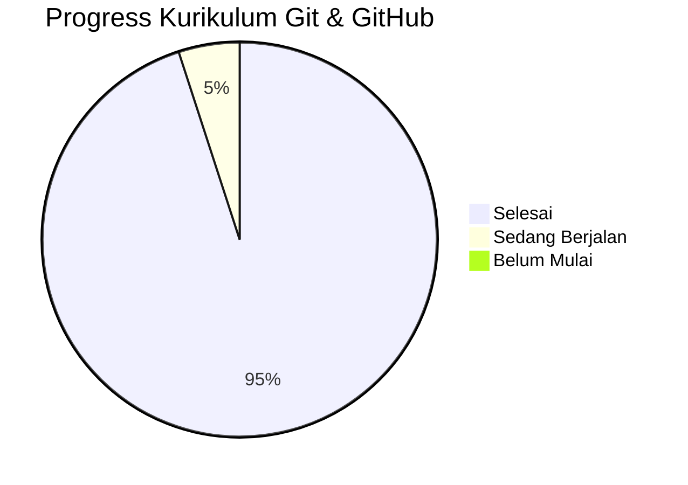

# 🚀 GitHub Latihan

> Repo latihan Git & GitHub — dari dasar sampai tingkat expert.
> Dibuat oleh [fajriluckyboy](https://github.com/fajriluckyboy) sebagai dokumentasi perjalanan belajar.


---

## ✨ Fitur

- 📝 Catatan lengkap Git dari dasar hingga expert
- 🔀 Simulasi workflow Pull Request & Code Review
- ⚙️ GitHub Actions CI/CD (workflow, matrix, reusable)
- 📦 Git LFS untuk file besar
- 🌐 GitHub Pages aktif
- 📊 Diagram Mermaid (flowchart, sequence, gantt, gitGraph, pie)

---

## 📁 Struktur Repo

```
github-latihan/
├── docs/
│   ├── panduan.txt
│   ├── markdown-lanjutan.md
│   └── mermaid-diagram.md
├── src/
│   └── main.txt
├── .github/
│   ├── workflows/
│   ├── ISSUE_TEMPLATE/
│   ├── PULL_REQUEST_TEMPLATE.md
│   └── CODEOWNERS
├── index.html
└── README.md
```

---

## 🚀 GitHub Pages

Repo ini punya halaman web aktif:

🔗 [https://fajriluckyboy.github.io/github-latihan](https://fajriluckyboy.github.io/github-latihan)

---

## 📊 Progress Belajar



---

## 🤝 Kontribusi

1. Fork repo ini
2. Buat branch baru (`git checkout -b fitur-baru`)
3. Commit perubahan (`git commit -m "tambah fitur baru"`)
4. Push ke branch (`git push origin fitur-baru`)
5. Buat Pull Request

---

## 📄 Lisensi

Repo ini dibuat untuk tujuan pembelajaran. Bebas digunakan sebagai referensi.
