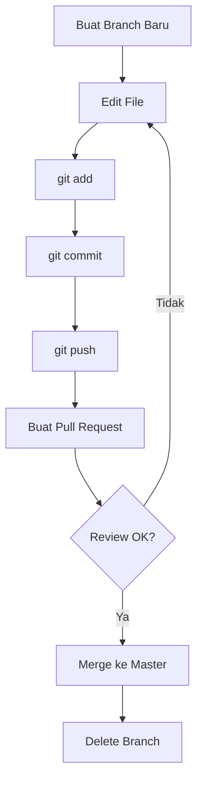
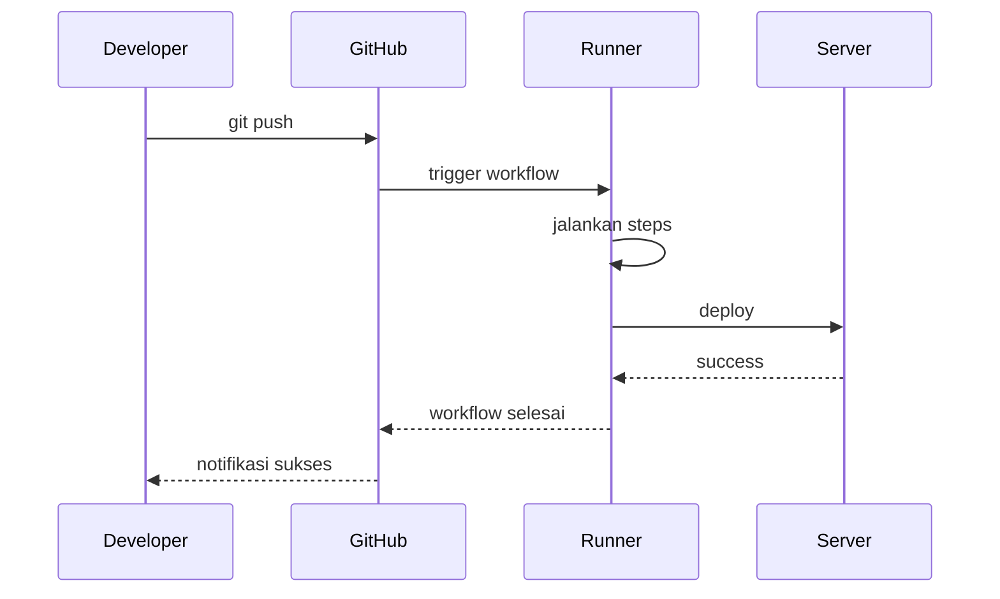
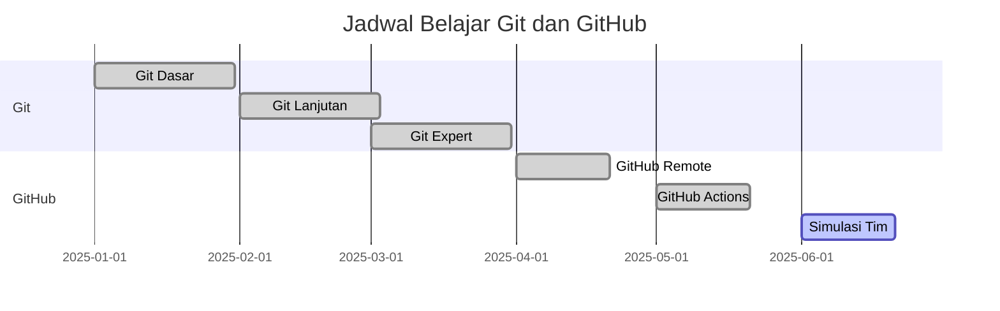
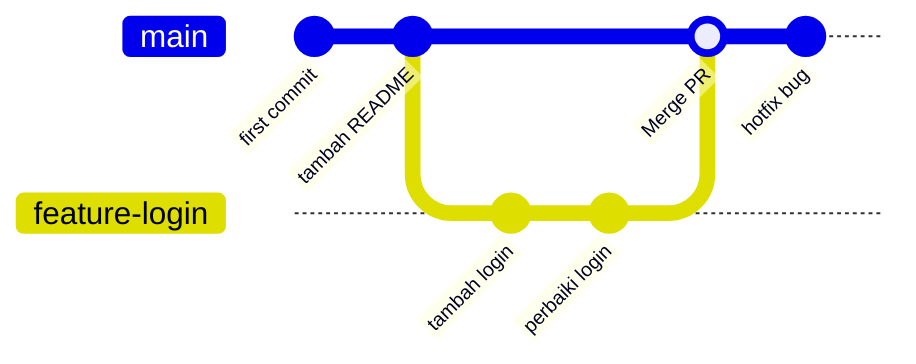
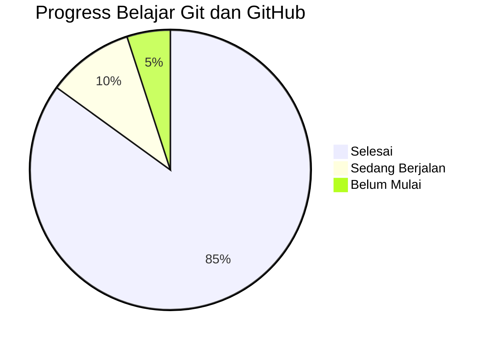

# Diagram Mermaid di GitHub

## 1. Flowchart - Alur Git Workflow

## 2. Sequence Diagram - Alur GitHub Actions

## 3. Gantt - Jadwal Belajar

## 4. Git Graph - Visualisasi Branch

## 5. Pie Chart - Progress Kurikulum

